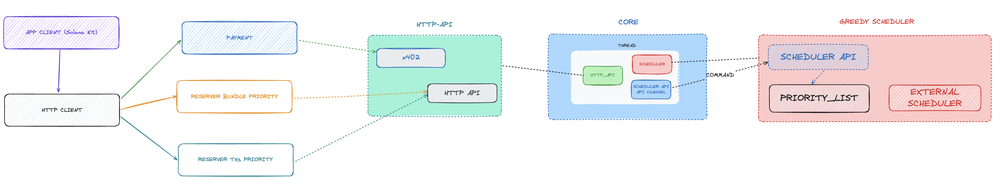
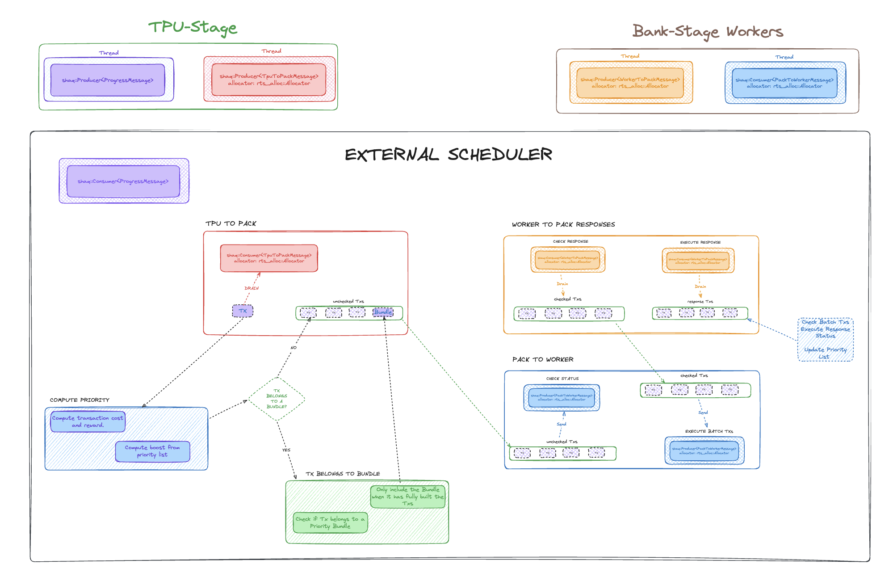

# Atomix

High-performance transaction scheduler for Solana with advanced priority management, quota systems, bundle support, HTTP API and x402 for priority payment.

## 🌟 Features

- **Priority-Based Scheduling** - Prioritize transactions by signers or program IDs with configurable multiplier
- **Quota Management** - Set transaction limits for priority entries with automatic depletion
- **Bundle Support** - Group transactions with automatic batching and tip-based prioritization
- **Priority Payment** - Pay for priority transactions with x402 tokens
- **HTTP REST API** - Remote management and real-time monitoring
- **Performance Metrics** - Real-time throughput, latency, and efficiency tracking
- **Load Testing Tools** - Comprehensive testing suite in Rust
- **Execution Statistics** - Per-signer/program success rates and transaction counts

## 🏗️ Architecture




---

## 🚀 Quick Start

### Installation

```bash
# Clone the repository
git clone <repository-url>
cd ext-scheduler-bindings

# Build all components
cargo build --release
```

### Basic Usage

```bash
# Start the scheduler with HTTP API
./target/release/core \
  --bindings-ipc /path/to/scheduler_bindings.ipc \
  --http-addr 127.0.0.1:8080

# Add a priority signer with 1000 transaction quota
curl -X POST http://localhost:8080/priority/signer \
  -H "Content-Type: application/json" \
  -d '{"pubkey": "YourPubkey...", "quota": 1000}'

# Run load test
./target/release/load-test \
  --rpc-url http://localhost:8899 \
  --num-transactions 1000 \
  --concurrency 50 \
  --transaction-type memo
```

### Quick Load Testing

```bash
# Rust (recommended for performance)
cargo build --release --bin load-test
./target/release/load-test \
  --rpc-url http://localhost:8899 \
  --num-transactions 1000 \
  --concurrency 50 \
  --transaction-type memo \
  --no-confirm  # 10-30x faster!
```

---

## 📚 Core Components

### 1. Greedy Scheduler

Advanced transaction scheduler with priority lists and quota management.

#### Key Features

- **Priority Signers and Programs**: Boost specific wallets or program IDs
- **Configurable Priority Multiplier**: Default 10x, adjustable (e.g., 15x, 20x)
- **Automatic Quota Tracking**: Decrements on execution, auto-removes when exhausted
- **Execution Statistics**: Per-signer/program success rates and counts
- **In-Memory Priority Lists**: O(1) lookups with HashSet

#### Priority List Usage

**Add Priority Signers:**
```rust
use solana_pubkey::Pubkey;
use std::str::FromStr;

let vip_wallet = Pubkey::from_str("DYw8jCTfwHNRJhhmFcbXvVDTqWMEVFBX6ZKUmG5CNSKK").unwrap();

// Add with quota (limited transactions)
scheduler.add_priority_signer_with_quota(vip_wallet, 1000);

// Add unlimited
scheduler.add_priority_signer(vip_wallet);

// Remove
scheduler.remove_priority_signer(&vip_wallet);
```

**Add Priority Programs:**
```rust
let raydium = Pubkey::from_str("675kPX9MHTjS2zt1qfr1NYHuzeLXfQM9H24wFSUt1Mp8").unwrap();

scheduler.add_priority_program_with_quota(raydium, 500);
scheduler.add_priority_program(raydium);
scheduler.remove_priority_program(&raydium);
```

**Configure Multiplier:**
```rust
// Set 15x boost for priority transactions
scheduler.set_priority_multiplier(15);
```

**How It Works:**
1. Transaction arrives with base priority (calculated from fees/cost)
2. Scheduler checks if transaction has priority signer or program
3. If match found, multiplies priority by configured factor (e.g., 10x)
4. Transaction inserted into queue with boosted priority
5. On successful execution, quota decremented
6. When quota reaches 0, entry auto-removed

#### Use Cases

**VIP Wallets:**
```rust
// Market makers, high-value traders
let mm_wallets = vec!["wallet1...", "wallet2...", "wallet3..."];
for wallet in mm_wallets {
    let pubkey = Pubkey::from_str(wallet).unwrap();
    scheduler.add_priority_signer_with_quota(pubkey, 10000);
}
```

**DEX Prioritization:**
```rust
// Prioritize major DEXs
let dexs = vec![
    "675kPX9MHTjS2zt1qfr1NYHuzeLXfQM9H24wFSUt1Mp8", // Raydium
    "9W959DqEETiGZocYWCQPaJ6sBmUzgfxXfqGeTEdp3aQP", // Orca
];
for dex in dexs {
    scheduler.add_priority_program(Pubkey::from_str(dex).unwrap());
}
```

---

### 2. HTTP API

RESTful API for remote scheduler management and monitoring.

#### Starting the Server

```bash
# Default: localhost:8080 (no payment verification)
./core --bindings-ipc /path/to/ipc

# Custom address
./core --bindings-ipc /path/to/ipc --http-addr 0.0.0.0:3000

# With x402 payment verification
./core --bindings-ipc /path/to/ipc \
  --rpc-url http://localhost:8899 \
  --payment-recipient 6BgmS3qMQcLi6pj5xSNoyFAGctt1YJAPsyiNrmeLo3xj
```

#### x402 Payment Protocol

The HTTP API supports HTTP 402 (Payment Required) for monetizing scheduler priority access. When enabled, clients must pay 0.001 SOL per operation.

**Payment-Protected Endpoints:**
- `POST /priority/signer` (with quota)
- `POST /priority/program` (with quota)
- `POST /bundles/signer`
- `POST /bundles/program`

**How It Works:**
1. Client sends 0.001 SOL to payment recipient
2. Client gets transaction signature
3. Client includes signature in API request
4. Server verifies payment on-chain (with retries)
5. Request processed if payment verified

**Payment Verification:**
- Checks transaction exists and succeeded
- Verifies amount >= 1,000,000 lamports (0.001 SOL)
- Automatic retry with exponential backoff (handles RPC indexing delay)
- Up to 5 retries: 100ms → 200ms → 400ms → 800ms → 1600ms

**Example with Payment:**
```bash
# 1. Create payment transaction (0.001 SOL)
SIGNATURE=$(solana transfer 6BgmS3qMQcLi6pj5xSNoyFAGctt1YJAPsyiNrmeLo3xj 0.001 --output json | jq -r '.signature')

# 2. Use signature to add priority signer
curl -X POST http://localhost:8080/priority/signer \
  -H "Content-Type: application/json" \
  -d "{
    \"pubkey\": \"YourPubkey...\",
    \"quota\": 1000,
    \"payment_signature\": \"$SIGNATURE\"
  }"
```

**Testing x402 with Load Tester:**
```bash
# Test x402 payment flow
cargo run -p load-tester -- \
  --transaction-type x402_payment \
  --payment-recipient 6BgmS3qMQcLi6pj5xSNoyFAGctt1YJAPsyiNrmeLo3xj \
  --num-transactions 10

# Test priority signer with payment
cargo run -p load-tester -- \
  --transaction-type x402_priority_signer \
  --payment-recipient 6BgmS3qMQcLi6pj5xSNoyFAGctt1YJAPsyiNrmeLo3xj \
  --priority-quota 5000 \
  --num-transactions 10 \
  --api-url http://localhost:8080

# Test bundle with payment (uses transaction signatures for identification)
cargo run -p load-tester -- \
  --transaction-type x402_bundle \
  --payment-recipient 6BgmS3qMQcLi6pj5xSNoyFAGctt1YJAPsyiNrmeLo3xj \
  --num-transactions 10
```

**Note**: x402 bundle operations use **transaction signatures** (first 32 bytes) instead of message hashes for bundle identification. This ensures consistency as message hashes can change due to blockhash updates.

**Disable Payment Verification:**
```bash
# Omit --rpc-url and --payment-recipient to disable
./core --bindings-ipc /path/to/ipc
```

**Payment Error Responses:**
```bash
# Missing payment signature
HTTP 402 Payment Required
{"error": "Payment required for quota-based operations"}

# Invalid/insufficient payment
HTTP 402 Payment Required
{"error": "Payment verification failed: Insufficient payment"}

# Transaction not found (still indexing)
HTTP 402 Payment Required
{"error": "Payment verification failed: Transaction not found after 5 retries"}
```

#### Endpoints Overview

**Health Check:**
- `GET /health` - Verify API is running

**Signer Management:**
- `POST /priority/signer` - Add signer with optional quota
- `DELETE /priority/signer/:pubkey` - Remove signer
- `GET /priority/signer/:pubkey/stats` - Get execution statistics
- `GET /priority/signer/:pubkey/quota` - Get quota status
- `POST /priority/signer/:pubkey/quota/increment` - Extend quota

**Program Management:**
- `POST /priority/program` - Add program with optional quota
- `DELETE /priority/program/:pubkey` - Remove program
- `GET /priority/program/:pubkey/stats` - Get execution statistics
- `GET /priority/program/:pubkey/quota` - Get quota status
- `POST /priority/program/:pubkey/quota/increment` - Extend quota

**Bundle Management:**
- `POST /bundles/signer` - Add bundle signer
- `POST /bundles/signer/:pubkey/tip` - Update tip
- `POST /bundles/signer/:pubkey/tx-hashes` - Add transaction hashes
- `GET /bundles/signer/:pubkey` - Get bundle details
- `DELETE /bundles/signer/:pubkey` - Remove bundle
- `GET /bundles/signers` - List all signer bundles
- `POST /bundles/program` - Add bundle program
- `POST /bundles/program/:pubkey/tip` - Update tip
- `POST /bundles/program/:pubkey/tx-hashes` - Add transaction hashes
- `GET /bundles/program/:pubkey` - Get bundle details
- `DELETE /bundles/program/:pubkey` - Remove bundle
- `GET /bundles/programs` - List all program bundles
- `POST /bundles/clear` - Clear all bundles

**Configuration:**
- `POST /priority/multiplier` - Set priority multiplier
- `POST /priority/clear` - Clear all priority lists
- `POST /priority/clear/stats` - Clear statistics only

**Metrics:**
- `GET /metrics` - All metrics (signers + programs)
- `GET /metrics/signers` - Signer metrics only
- `GET /metrics/programs` - Program metrics only
- `GET /metrics/performance` - Performance metrics (TPS, latency, efficiency)
- `POST /metrics/performance/reset` - Reset performance metrics

#### API Examples

**Add VIP Signer:**
```bash
curl -X POST http://localhost:8080/priority/signer \
  -H "Content-Type: application/json" \
  -d '{
    "pubkey": "DYw8jCTfwHNRJhhmFcbXvVDTqWMEVFBX6ZKUmG5CNSKK",
    "quota": 1000
  }'
```

**Check Quota Status:**
```bash
curl http://localhost:8080/priority/signer/DYw8jCTfwHNRJhhmFcbXvVDTqWMEVFBX6ZKUmG5CNSKK/quota
```

**Response:**
```json
{
  "pubkey": "DYw8jCTfwHNRJhhmFcbXvVDTqWMEVFBX6ZKUmG5CNSKK",
  "remaining_quota": 150,
  "initial_quota": 1000,
  "usage_percentage": 0.85
}
```

**Get Execution Statistics:**
```bash
curl http://localhost:8080/priority/signer/DYw8jCTfwHNRJhhmFcbXvVDTqWMEVFBX6ZKUmG5CNSKK/stats
```

**Response:**
```json
{
  "pubkey": "DYw8jCTfwHNRJhhmFcbXvVDTqWMEVFBX6ZKUmG5CNSKK",
  "total_executed": 850,
  "successful": 842,
  "success_rate": 0.990588,
  "quota_remaining": 150,
  "quota_initial": 1000,
  "quota_usage_pct": 0.85
}
```

**Extend Quota:**
```bash
curl -X POST http://localhost:8080/priority/signer/DYw8jCTfwHNRJhhmFcbXvVDTqWMEVFBX6ZKUmG5CNSKK/quota/increment \
  -H "Content-Type: application/json" \
  -d '{"amount": 500}'
```

**Set Priority Multiplier:**
```bash
curl -X POST http://localhost:8080/priority/multiplier \
  -H "Content-Type: application/json" \
  -d '{"multiplier": 15}'
```

#### Quota Management Best Practices

**1. VIP Wallets with Daily Quota:**
```bash
# Add daily quota
curl -X POST http://localhost:8080/priority/signer \
  -H "Content-Type: application/json" \
  -d '{"pubkey": "VIPwallet...", "quota": 10000}'

# Auto-extend when usage > 80%
quota_pct=$(curl -s http://localhost:8080/priority/signer/VIPwallet.../quota | jq -r '.usage_percentage')
if (( $(echo "$quota_pct > 0.8" | bc -l) )); then
  curl -X POST http://localhost:8080/priority/signer/VIPwallet.../quota/increment \
    -H "Content-Type: application/json" \
    -d '{"amount": 5000}'
fi
```

**2. Limited-Time Program Prioritization:**
```bash
# Prioritize new DEX for first 1000 transactions
curl -X POST http://localhost:8080/priority/program \
  -H "Content-Type: application/json" \
  -d '{"pubkey": "NewDEX...", "quota": 1000}'

# Quota automatically depletes, no manual removal needed
```

**3. Promotional Campaign:**
```bash
# Add promotional wallets
for wallet in $(cat promotional_wallets.txt); do
  curl -X POST http://localhost:8080/priority/signer \
    -H "Content-Type: application/json" \
    -d "{\"pubkey\": \"$wallet\", \"quota\": 100}"
done

# Monitor campaign effectiveness
for wallet in $(cat promotional_wallets.txt); do
  curl -s "http://localhost:8080/priority/signer/$wallet/stats" | jq
done
```

---

### 3. Bundle API

Group multiple transactions with tip-based prioritization and automatic batching.

#### Features

- **Signer-Based Bundles**: Group transactions from specific wallets
- **Program-Based Bundles**: Group transactions calling specific programs
- **Automatic Transaction Grouping**: Holds transactions until all in bundle arrive
- **Tip-Based Priority**: Higher tips = higher priority
- **Multiple Hash Formats**: Supports hex, base58, and base64

#### Transaction Signature Hash Formats

**Important**: Bundle transactions are identified using the **first 32 bytes of the transaction signature** (not the message hash). This ensures consistent identification as message hashes can change due to blockhash updates.

**Client Responsibility**: The client is responsible for providing the transaction signature hash. Clients can send signatures in multiple formats, and the API will decode and process them accordingly.

**Supported Input Formats (POST requests):**

1. **Base58 Transaction Signature** (Solana native - recommended):
   ```json
   "tx_hashes": ["5VqZ8yfBKXp9kZ3nEq5fJ8YmGpZx9kYdH3fGq7Nx3kQ2aBcD7fHjK9mPqR8tS2uV3wX4yZ5aB6cC7dD8eE9fF1g"]
   ```
   When the client sends the full 64-byte signature, the API extracts the first 32 bytes for bundle matching.

2. **Hexadecimal** (32 bytes - first half of signature):
   ```json
   "tx_hashes": ["a1b2c3d4e5f6789012345678901234567890123456789012345678901234"]
   ```
   Client sends only the first 32 bytes directly as hex.

3. **Base64** (32 bytes):
   ```json
   "tx_hashes": ["obLDxOX2eJASNFZ4kBIzRniQEjNGeJASNFZ4kBIzRg=="]
   ```
   Client sends only the first 32 bytes encoded as base64.

**Output Format (GET responses) - Always hex (32 bytes):**
```json
"tx_hashes": ["a1b2c3d4e5f6789012345678901234567890123456789012345678901234"]
```

**Best Practice**:
- **Client-side**: Extract the transaction signature from `transaction.signature` after signing and send it as base58 string
- **API-side**: The API decodes the client-provided signature and uses the first 32 bytes internally for bundle matching
- This separation ensures the client controls what is sent while the API handles format conversion

#### Bundle Endpoints

**Add Bundle Signer:**
```bash
curl -X POST http://localhost:8080/bundles/signer \
  -H "Content-Type: application/json" \
  -d '{
    "pubkey": "YourWalletPubkey...",
    "tip": 10000000,
    "tx_hashes": [
      "a1b2c3d4e5f6789012345678901234567890123456789012345678901234",
      "1a2b3c4d5e6f789012345678901234567890123456789012345678901234"
    ]
  }'
```

**Add Bundle Program:**
```bash
curl -X POST http://localhost:8080/bundles/program \
  -H "Content-Type: application/json" \
  -d '{
    "pubkey": "675kPX9MHTjS2zt1qfr1NYHuzeLXfQM9H24wFSUt1Mp8",
    "tip": 50000000,
    "tx_hashes": [
      "abc123def456789012345678901234567890123456789012345678901234",
      "789xyz012abc345678901234567890123456789012345678901234567890"
    ]
  }'
```

**Update Bundle Tip:**
```bash
curl -X POST http://localhost:8080/bundles/signer/YourPubkey.../tip \
  -H "Content-Type: application/json" \
  -d '{"tip": 20000000}'
```

**Add More Transactions to Bundle:**
```bash
curl -X POST http://localhost:8080/bundles/signer/YourPubkey.../tx-hashes \
  -H "Content-Type: application/json" \
  -d '{
    "tx_hashes": [
      "f1e2d3c4b5a6789012345678901234567890123456789012345678901234"
    ]
  }'
```

**Get Bundle Details:**
```bash
curl http://localhost:8080/bundles/signer/YourPubkey...
```

**Response:**
```json
{
  "pubkey": "YourPubkey...",
  "tip": 10000000,
  "tx_hashes": [
    "a1b2c3d4e5f6789012345678901234567890123456789012345678901234",
    "1a2b3c4d5e6f789012345678901234567890123456789012345678901234"
  ],
  "tx_count": 2
}
```

**List All Bundles:**
```bash
# List signer bundles
curl http://localhost:8080/bundles/signers

# List program bundles
curl http://localhost:8080/bundles/programs
```

**Remove Bundle:**
```bash
curl -X DELETE http://localhost:8080/bundles/signer/YourPubkey...
```

**Clear All Bundles:**
```bash
curl -X POST http://localhost:8080/bundles/clear
```

#### Bundle Grouping (Automatic Batching)

The scheduler automatically groups transactions belonging to the same bundle:

1. **Transaction Arrives**: Scheduler checks if message hash matches any bundle
2. **Match Found**: Transaction stored in buffer, waiting for other bundle transactions
3. **Bundle Complete**: When all transactions arrive, they're processed together as a group
4. **Non-Bundle**: Transactions not in any bundle are processed normally

This ensures all transactions in a bundle execute in sequence.

#### Bundle Use Cases

**1. Trading Bundle (MEV Protection):**
```bash
curl -X POST http://localhost:8080/bundles/signer \
  -H "Content-Type: application/json" \
  -d '{
    "pubkey": "TraderWallet...",
    "tip": 50000000,
    "tx_hashes": [
      "swap_tx_hash_1...",
      "swap_tx_hash_2...",
      "swap_tx_hash_3..."
    ]
  }'
```

**2. DEX Launch Bundle:**
```bash
curl -X POST http://localhost:8080/bundles/program \
  -H "Content-Type: application/json" \
  -d '{
    "pubkey": "NewDEXProgram...",
    "tip": 100000000,
    "tx_hashes": [
      "init_pool_tx...",
      "add_liquidity_tx...",
      "first_swap_tx..."
    ]
  }'
```

**3. Monitor Bundle Status:**
```bash
# Watch bundles in real-time
watch -n 1 'curl -s http://localhost:8080/bundles/signers | jq'
```

#### Bundle vs Priority System

**Bundles:**
- Tip-based priority (no multiplier)
- Automatic transaction grouping
- No quota limits
- Best for: MEV protection, atomic operations

**Priority Lists:**
- Quota-based with multiplier
- Individual transaction processing
- Limited quotas
- Best for: VIP wallets, protocol prioritization

**Can use both simultaneously** for maximum flexibility!

---

### 4. Performance Metrics

Real-time tracking of scheduler performance across all pipeline stages.

#### Metrics Tracked

**Throughput:**
- `tpu_ingestion_tps` - TPU ingestion rate (tx/second)
- `execution_tps` - Execution rate (tx/second)

**Latency (microseconds):**
- `avg_tpu_processing_time_us` - Average TPU processing time
- `avg_check_processing_time_us` - Average verification time
- `avg_execution_time_us` - Average execution time

**Efficiency (0.0 to 1.0):**
- `check_pass_rate` - Verification pass rate
- `execution_completion_rate` - Execution completion rate
- `overall_efficiency` - Overall (executed / received)

**Volume:**
- `tpu_messages_received` - TPU messages received
- `tpu_transactions_received` - Transactions from TPU
- `transactions_sent_to_check` - Sent to verification
- `transactions_checked` - Verified successfully
- `transactions_sent_to_execute` - Sent to execution
- `transactions_executed` - Executed successfully
- `total_transactions_processed` - Total processed

**Queue Status:**
- `unchecked_queue_depth` - Unchecked queue size
- `checked_queue_depth` - Checked queue size
- `in_flight_cost` - In-flight computational cost

#### Performance API

**Get Performance Metrics:**
```bash
curl http://localhost:8080/metrics/performance | jq '.'
```

**Response Example:**
```json
{
  "tpu_ingestion_tps": 1250.5,
  "execution_tps": 980.3,
  "avg_tpu_processing_time_us": 125.5,
  "avg_check_processing_time_us": 450.2,
  "avg_execution_time_us": 1250.8,
  "check_pass_rate": 0.95,
  "execution_completion_rate": 0.98,
  "overall_efficiency": 0.78,
  "tpu_messages_received": 150,
  "tpu_transactions_received": 125000,
  "transactions_sent_to_check": 120000,
  "transactions_checked": 114000,
  "transactions_sent_to_execute": 110000,
  "transactions_executed": 98000,
  "total_transactions_processed": 98000,
  "unchecked_queue_depth": 500,
  "checked_queue_depth": 1200,
  "in_flight_cost": 45000000,
  "elapsed_seconds": 100.5
}
```

**Reset Metrics:**
```bash
curl -X POST http://localhost:8080/metrics/performance/reset
```

#### Execution Statistics

**Get Signer/Program Metrics:**
```bash
# All metrics
curl http://localhost:8080/metrics

# Signers only
curl http://localhost:8080/metrics/signers

# Programs only
curl http://localhost:8080/metrics/programs
```

**Response Example:**
```json
{
  "signers": {
    "Pubkey123...": {
      "total_executed": 1500,
      "successful": 1485,
      "success_rate": 0.99
    }
  },
  "programs": {
    "Program456...": {
      "total_executed": 3200,
      "successful": 3180,
      "success_rate": 0.99375
    }
  },
  "total_signers": 5,
  "total_programs": 3
}
```

#### Performance Benchmarks

**Typical Throughput:**

| Environment | TPS (with confirm) | TPS (no confirm) |
|-------------|-------------------|------------------|
| Local Validator | 1000-2000 | 5000-10000 |
| Devnet | 50-200 | 200-500 |
| Mainnet (public) | 10-50 | 50-100 |

**Normal Latencies:**

| Phase | Expected Latency |
|-------|------------------|
| TPU Processing | < 200 μs |
| Check Phase | 200-1000 μs |
| Execution Phase | 500-2000 μs |

**Healthy Efficiency:**

| Metric | Good | Warning | Critical |
|--------|------|---------|----------|
| Check Pass Rate | > 90% | 80-90% | < 80% |
| Execution Rate | > 95% | 90-95% | < 90% |
| Overall Efficiency | > 70% | 50-70% | < 50% |

#### Monitoring Use Cases

**1. Measure Load Test Performance:**
```bash
# Terminal 1: Reset and run load test
curl -X POST http://localhost:8080/metrics/performance/reset
./target/release/load-test --num-transactions 10000 --no-confirm

# Terminal 2: Monitor performance
watch -n 1 'curl -s http://localhost:8080/metrics/performance | jq "{tps: .execution_tps, efficiency: .overall_efficiency}"'
```

**2. Identify Bottlenecks:**
```bash
# See where transactions are being lost
curl -s http://localhost:8080/metrics/performance | jq '{
  received: .tpu_transactions_received,
  checked: .transactions_checked,
  executed: .transactions_executed,
  check_loss: (.tpu_transactions_received - .transactions_checked),
  exec_loss: (.transactions_checked - .transactions_executed)
}'
```

**3. Compare Configurations:**
```bash
#!/bin/bash
configs=("config1" "config2" "config3")

for config in "${configs[@]}"; do
  curl -X POST http://localhost:8080/metrics/performance/reset
  ./target/release/load-test --config "$config" --num-transactions 10000

  tps=$(curl -s http://localhost:8080/metrics/performance | jq -r '.execution_tps')
  echo "$config: $tps TPS"
done
```

**4. Low Performance Alert:**
```bash
#!/bin/bash
THRESHOLD=500

while true; do
  tps=$(curl -s http://localhost:8080/metrics/performance | jq -r '.execution_tps')

  if (( $(echo "$tps < $THRESHOLD" | bc -l) )); then
    echo "⚠️  LOW TPS: $tps (threshold: $THRESHOLD)"
    # Send alert
  fi

  sleep 10
done
```

---

### 5. Load Testing Suite

Comprehensive load testing tools in multiple languages.

#### Available Tools

1. **Rust** (High-performance, production-ready)
2. **Python** (Easy to customize)
3. **TypeScript** (JavaScript ecosystem integration)
4. **Bash** (Simple CLI scripts)

#### Rust Load Tester (Recommended)

**Build:**
```bash
cargo build --release --bin load-test
```

**Basic Usage:**
```bash
./target/release/load-test \
  --rpc-url http://localhost:8899 \
  --num-transactions 1000 \
  --concurrency 50 \
  --transaction-type memo
```

**Transaction Types:**
- `airdrop` - Request SOL airdrops
- `transfer` - SOL transfers
- `bundle_transfer` - Medium (SOL transfer)
- `memo` - Memo program (lowest overhead)
- `compute` - Compute budget instructions
- `x402_payment` - x402 payment transaction (0.001 SOL)
- `x402_priority_signer` - Payment + add priority signer via API
- `x402_bundle` - Payment + add bundle signer via API (uses transaction signatures)

**Advanced Options:**
```bash
./target/release/load-test \
  --rpc-url http://localhost:8899 \
  --num-transactions 10000 \
  --concurrency 100 \
  --transaction-type memo \
  --no-confirm \          # 10-30x faster!
  --keypair /path/to/keypair.json \
  --dry-run               # Test without sending

# x402 specific options
./target/release/load-test \
  --transaction-type x402_priority_signer \
  --api-url http://localhost:8080 \
  --payment-recipient 6BgmS3qMQcLi6pj5xSNoyFAGctt1YJAPsyiNrmeLo3xj \
  --priority-quota 5000   # Quota for priority signer
```

**Ultra-Fast Mode (no confirmation):**
```bash
# With confirmation (accurate, slower)
./target/release/load-test \
  --num-transactions 1000 \
  --concurrency 50 \
  --transaction-type memo
# ~200-500 TPS

# Without confirmation (ultra-fast!)
./target/release/load-test \
  --num-transactions 10000 \
  --concurrency 200 \
  --transaction-type memo \
  --no-confirm
# ~5000-10000 TPS on local validator!
```

#### Example Output

```
=== Solana Load Test ===
RPC URL: http://localhost:8899
Transaction Type: Memo
Total Transactions: 1000
Concurrency: 50
Payer: 7xKZ...abc123

Current balance: 2.5 SOL

✓ Transaction 1 completed in 145.32ms
✓ Transaction 2 completed in 152.18ms
✓ Transaction 3 completed in 148.94ms
...

=== Test Results ===
Total Duration: 15.42s
Total Transactions: 1000
Successful: 987 (98.70%)
Failed: 13 (1.30%)

Latency Statistics:
  Average: 154.23ms
  Min: 125.45ms
  Max: 342.18ms

Throughput: 64.89 TPS
```

#### Common Use Cases

**1. Stress Test Local Validator:**
```bash
./target/release/load-test \
  --rpc-url http://localhost:8899 \
  --num-transactions 10000 \
  --concurrency 100 \
  --transaction-type compute
```

**2. Measure Latency:**
```bash
./target/release/load-test \
  --rpc-url http://localhost:8899 \
  --num-transactions 100 \
  --concurrency 1 \
  --transaction-type transfer \
  --amount 0.001
```

**3. Maximum Throughput Test:**
```bash
./target/release/load-test \
  --rpc-url http://localhost:8899 \
  --num-transactions 10000 \
  --concurrency 200 \
  --transaction-type memo \
  --no-confirm
```

#### Troubleshooting

**"Account not found":**
```bash
solana airdrop 2
```

**"429 Too Many Requests":**
- Reduce `--concurrency` to 5 or less
- Use private RPC endpoint

**Low Performance:**
- Use `transaction-type memo` for minimum overhead
- Increase `--concurrency` if RPC supports
- Use local validator for best performance
- Use `--no-confirm` for maximum throughput

---

## 🏗️ Architecture

```
┌─────────────────┐
│   HTTP Client   │
│  (curl/Python)  │
└────────┬────────┘
         │ REST API
         ▼
┌─────────────────┐
│   HTTP Server   │
│   (Axum/Tokio)  │
└────────┬────────┘
         │ Commands
         ▼
┌─────────────────┐
│  MPSC Channel   │
│ (Thread-safe)   │
└────────┬────────┘
         │
         ▼
┌─────────────────┐
│ Scheduler Thread│
│  (Process Cmd)  │
└────────┬────────┘
         │
         ▼
┌─────────────────┐
│ GreedyScheduler │
│ + PriorityList  │
│ + Bundles       │
│ + Statistics    │
└─────────────────┘
```

**Key Design Principles:**
- **Async Architecture**: HTTP server in separate Tokio task
- **Lock-Free Communication**: MPSC channels for thread safety
- **In-Memory State**: All data structures in-memory (not persisted)
- **O(1) Lookups**: HashSet/HashMap for priority checks
- **Non-Blocking**: Commands processed in scheduler's main loop

---

## 📦 Project Structure

```
ext-scheduler-bindings/
├── core/                      # Main scheduler binary
│   ├── src/
│   │   ├── api.rs            # Re-exports SchedulerApi from greedy-scheduler
│   │   ├── control_thread.rs # Control thread management
│   │   ├── scheduler_thread.rs # Scheduler thread
│   │   ├── args.rs           # CLI arguments
│   │   └── main.rs           # Entry point
│   └── Cargo.toml
│
├── http_api/                  # HTTP REST API (library crate)
│   ├── src/
│   │   └── lib.rs            # REST API endpoints and router
│   └── Cargo.toml
│
├── greedy-scheduler/          # Core scheduler implementation
│   ├── src/
│   │   ├── lib.rs            # Main scheduler logic
│   │   ├── api.rs            # SchedulerApi (MPSC channel wrapper)
│   │   ├── priority_list.rs  # Priority management
│   │   ├── performance_metrics.rs # Performance tracking
│   │   ├── priority_id.rs    # Priority ID implementation
│   │   └── transaction_map.rs # Transaction state management
│   └── Cargo.toml
│
├── greedy-scheduler-bench/    # Criterion benchmarks
│   ├── benches/
│   │   └── scheduler_throughput.rs
│   └── README.md
│
├── load-tester/              # Load testing tools
│   ├── src/main.rs          # Rust implementation
│   └── README.md
│
└── README.md                 # This file
```

### Crate Dependencies

```
core (binary)
├── http_api (library)
│   └── greedy-scheduler (library)
│       └── api module
└── greedy-scheduler (library)
    └── api module

http_api (library)
└── greedy-scheduler (library)
    └── api module (SchedulerApi, QueryResponse, SchedulerCommand)

greedy-scheduler (library)
└── api module (public)
    └── Exports: SchedulerApi, QueryResponse, SchedulerCommand
```

### Module Organization

**core:** Binary application that starts the scheduler and HTTP server
- Uses `http_api::start_server()` to start the HTTP API
- Uses `greedy_scheduler::api::SchedulerApi` for scheduler communication
- Manages scheduler thread and control flow

**http_api:** Library crate with REST API implementation
- Depends on `greedy_scheduler` for `SchedulerApi`
- Exports `start_server()`, `create_router()` functions
- All HTTP endpoints and request/response types
- Can be reused in other projects

**greedy-scheduler:** Core scheduler library
- Contains `api` module with `SchedulerApi`
- `SchedulerApi` uses MPSC channels for thread-safe communication
- Exports priority management, bundle support, and metrics

---

## 🔧 Configuration

### Scheduler Options

```bash
./target/release/core \
  --bindings-ipc /path/to/scheduler.sock \
  --http-addr 0.0.0.0:8080 \
  --priority-multiplier 15
```

### Load Tester Options

```bash
./target/release/load-test \
  --rpc-url http://localhost:8899 \
  --num-transactions 1000 \
  --concurrency 50 \
  --transaction-type memo \
  --keypair /path/to/keypair.json \
  --no-confirm \
  --dry-run
```

### Environment Variables

```bash
# Load tester
export RPC_URL=http://localhost:8899

# Monitor script
export API_URL=http://localhost:8080
```

---

## 🎯 Complete Use Case Examples

### 1. VIP Wallet Management

```bash
# Add VIP wallet with daily quota
curl -X POST http://localhost:8080/priority/signer \
  -H "Content-Type: application/json" \
  -d '{"pubkey": "VIPWallet...", "quota": 10000}'

# Monitor usage
curl http://localhost:8080/priority/signer/VIPWallet.../stats

# Auto-extend quota when > 80% used
quota_pct=$(curl -s http://localhost:8080/priority/signer/VIPWallet.../quota | jq -r '.usage_percentage')
if (( $(echo "$quota_pct > 0.8" | bc -l) )); then
  curl -X POST http://localhost:8080/priority/signer/VIPWallet.../quota/increment \
    -H "Content-Type: application/json" \
    -d '{"amount": 5000}'
fi

# Daily quota reset (via cron)
0 0 * * * curl -X DELETE http://localhost:8080/priority/signer/VIPWallet... && \
          curl -X POST http://localhost:8080/priority/signer \
          -H "Content-Type: application/json" \
          -d '{"pubkey": "VIPWallet...", "quota": 10000}'
```

### 2. DEX Launch Support

```bash
# Prioritize new DEX program for first 5000 transactions
curl -X POST http://localhost:8080/priority/program \
  -H "Content-Type: application/json" \
  -d '{"pubkey": "NewDEX...", "quota": 5000}'

# Monitor progress
watch -n 10 'curl -s http://localhost:8080/priority/program/NewDEX.../quota | jq'

# Quota automatically expires when exhausted
```

### 3. Bundle-Based Trading

```bash
# Create trading bundle with tip
curl -X POST http://localhost:8080/bundles/signer \
  -H "Content-Type: application/json" \
  -d '{
    "pubkey": "Trader...",
    "tip": 50000000,
    "tx_hashes": ["hash1", "hash2", "hash3"]
  }'

# Increase tip if needed
curl -X POST http://localhost:8080/bundles/signer/Trader.../tip \
  -H "Content-Type: application/json" \
  -d '{"tip": 100000000}'
```

### 4. Load Testing & Benchmarking

```bash
# Reset metrics
curl -X POST http://localhost:8080/metrics/performance/reset

# Run stress test
./target/release/load-test \
  --rpc-url http://localhost:8899 \
  --num-transactions 10000 \
  --concurrency 100 \
  --transaction-type compute \
  --no-confirm

# View results
curl http://localhost:8080/metrics/performance | jq '.'
```

### 5. Promotional Campaign

```bash
# Add promotional wallets
for wallet in $(cat promotional_wallets.txt); do
  curl -X POST http://localhost:8080/priority/signer \
    -H "Content-Type: application/json" \
    -d "{\"pubkey\": \"$wallet\", \"quota\": 100}"
done

# Monitor campaign effectiveness
for wallet in $(cat promotional_wallets.txt); do
  echo "=== $wallet ==="
  curl -s "http://localhost:8080/priority/signer/$wallet/stats" | jq
done
```

---

## 🔒 Security Considerations

### Current Implementation

⚠️ **Not production-ready for public exposure:**
- No authentication
- No rate limiting
- No HTTPS (plain HTTP)
- Binds to localhost by default

### Production Recommendations

**1. Reverse Proxy with TLS:**
```nginx
# nginx.conf
server {
    listen 443 ssl;
    server_name scheduler.example.com;

    ssl_certificate /path/to/cert.pem;
    ssl_certificate_key /path/to/key.pem;

    location / {
        proxy_pass http://127.0.0.1:8080;
        proxy_set_header Host $host;
        proxy_set_header X-Real-IP $remote_addr;
    }
}
```

**2. API Key Authentication:**
```bash
# Add custom header
curl -X POST http://localhost:8080/priority/signer \
  -H "X-API-Key: your-secret-key" \
  -H "Content-Type: application/json" \
  -d '{"pubkey": "...", "quota": 1000}'
```

**3. Rate Limiting:**
```nginx
limit_req_zone $binary_remote_addr zone=scheduler:10m rate=10r/s;

location / {
    limit_req zone=scheduler burst=20;
    proxy_pass http://127.0.0.1:8080;
}
```

**4. Network Security:**
```bash
# Firewall rules (allow only trusted IPs)
sudo ufw allow from 10.0.0.0/8 to any port 8080

# IP whitelisting in nginx
allow 10.0.0.0/8;
deny all;
```

**5. Monitoring & Logging:**
```bash
# Log all API requests
tail -f /var/log/nginx/access.log | grep scheduler
```

---

## 🧪 Testing

### Unit Tests

```bash
# Run all tests
cargo test --workspace

# Run specific package
cargo test --package greedy-scheduler

# Run with output
cargo test --package greedy-scheduler -- --nocapture
```

### Integration Tests

```bash
# Run integration tests
cargo test --package greedy-scheduler -- --ignored
```

### Load Tests

```bash
# Quick test
./target/release/load-test \
  --num-transactions 100 \
  --concurrency 10

# Stress test
./target/release/load-test \
  --num-transactions 10000 \
  --concurrency 100 \
  --no-confirm
```

### Benchmarks

```bash
# Run benchmarks
cargo bench --package greedy-scheduler-bench

# View results
open target/criterion/report/index.html
```

---

## 🚀 Performance Optimization Tips

### 1. Local Validator

Use local validator for best performance:
```bash
solana-test-validator --reset
```

### 2. Transaction Type

Use lightweight transaction types:
- `memo` - Fastest (no state changes)
- `compute` - Fast (compute budget only)
- `transfer` - Medium (SOL transfer)
- `bundle_transfer` - Medium (SOL transfer)
- `airdrop` - Slowest (requires validator processing)

### 3. Concurrency Tuning

```bash
# Too low: Underutilized
--concurrency 5

# Good: Balanced
--concurrency 50

# Too high: May overwhelm RPC
--concurrency 500
```

### 4. No-Confirm Mode

```bash
# 10-30x faster, but less accurate
--no-confirm
```

### 5. Priority Multiplier

```bash
# Higher multiplier = more aggressive prioritization
curl -X POST http://localhost:8080/priority/multiplier \
  -H "Content-Type: application/json" \
  -d '{"multiplier": 20}'
```

---

## 🐛 Troubleshooting

### API Not Responding

```bash
# Check if server is running
curl http://localhost:8080/health

# Check process
ps aux | grep core

# Start if not running
./target/release/core --bindings-ipc /path/to/ipc
```

### Low TPS

**Check:**
1. Queue depths: `curl http://localhost:8080/metrics/performance | jq '.unchecked_queue_depth, .checked_queue_depth'`
2. Latencies: `curl http://localhost:8080/metrics/performance | jq '.avg_execution_time_us'`
3. Success rates: `curl http://localhost:8080/metrics/performance | jq '.check_pass_rate, .execution_completion_rate'`

### Quota Not Working

```bash
# Verify signer is in priority list
curl http://localhost:8080/priority/signer/YourPubkey.../quota

# Check remaining quota
curl http://localhost:8080/priority/signer/YourPubkey.../stats

# Verify multiplier is set
curl -X POST http://localhost:8080/priority/multiplier \
  -H "Content-Type: application/json" \
  -d '{"multiplier": 10}'
```

### Bundle Not Grouping

```bash
# Verify bundle exists
curl http://localhost:8080/bundles/signer/YourPubkey...

# Check transaction hashes match exactly
curl http://localhost:8080/bundles/signers | jq

# Verify all transactions were sent
```

---

## 📚 Additional Resources

### Command Reference

**Scheduler:**
```bash
./target/release/core --help
```

**Load Tester:**
```bash
./target/release/load-test --help
```

**Solana CLI:**
```bash
solana --help
solana-test-validator --help
```

### API Reference

All endpoints documented in HTTP API section above.

### Code Examples

See `load-tester/` directory for examples in:
- Rust (`src/main.rs`)

---

## 🤝 Contributing

Contributions welcome! Please:
1. Fork the repository
2. Create a feature branch
3. Write tests for new features
4. Ensure all tests pass
5. Submit a pull request

---

## 📄 License

See LICENSE file for details.

---

## 🙏 Acknowledgments

Built on top of Agave scheduler bindings for Solana.

---

**Quick Command Reference:**

```bash
# Start scheduler
./target/release/core --bindings-ipc /path/to/ipc --http-addr 127.0.0.1:8080

# Add priority signer
curl -X POST http://localhost:8080/priority/signer \
  -H "Content-Type: application/json" \
  -d '{"pubkey": "...", "quota": 1000}'

# Add bundle
curl -X POST http://localhost:8080/bundles/signer \
  -H "Content-Type: application/json" \
  -d '{"pubkey": "...", "tip": 10000000, "tx_hashes": ["..."]}'

# Run load test
./target/release/load-test --num-transactions 1000 --concurrency 50 --no-confirm

# Monitor performance
curl http://localhost:8080/metrics/performance | jq '.'

# Check stats
curl http://localhost:8080/metrics | jq '.'
```

---
